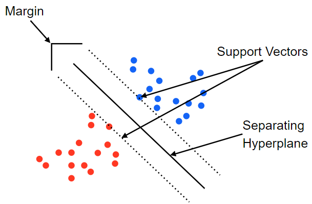

Standford CS231n Summary
------------------------

After watching all the videos of the famous Standford's CS231n course that took place in 2021, I decided to summarize the entire lecture for those who want to remember the content and learn more about it.

cs231n assignments

| assignments  | Contents                | Date       | check              |
|:------------:|:-----------------------:|:----------:|:------------------:|
| assignment_1 |           Knn           | 2021-07-10 | :white_check_mark: |
| assignment_1 |      SVM, Softmax       | 2021-07-11 | :white_check_mark: |
| assignment_1 | Two_layer_net, Features | 2021-07-13 | :white_check_mark: |
| assignment_2 |   FullyConnectedNets    | 2021-07-26 | :white_check_mark: |
| assignment_2 |   BatchNormalization    | 2021-07-26 | :white_check_mark: |
| assignment_1 |         Dropout         | 2021-07-27 | :white_check_mark: |
| assignment_1 |  ConvolutionalNetworks  | 2021-07-29 | :white_check_mark: |
| assignment_2 |   PyTorch, TensorFlow   | 2021-07-30 | :white_check_mark: |
| assignment_3 |      RNN_Captioning     | 2021-08-03 | :white_check_mark: |
| assignment_3 |  LSTM_Captioning  | 2021-08-04 | :white_check_mark: |
| assignment_3 | Transformer_Captioning  | | |
| assignment_3 |Generative_Adversarial_Networks | 2021-08-08 | :white_check_mark: |
| assignment_3 |   Network_Visualization    | 2021-08-10 | :white_check_mark: |
| assignment_3 | Self_Supervised_Learning  |  |  |

Any questions please email to :m: a01152a@gmail.com 

Explanation here :link: [RoadoneP Velog](https://velog.io/@a01152a) :smile:

EDA & FE
--------

> Exploratory Data Analysis (EDA) is an approach/philosophy for data analysis that employs a variety of techniques (mostly graphical) to

-	### [Kaggle-titanic](https://github.com/RoadoneP/ML-DL/tree/main/EDA_FE/titanic) 
	Kaggle 데이터 셋인 Titanic Machine Learning From Disaster의 EDA & FE 튜토리얼 입니다. 😊
-	### [Heart disease](https://github.com/RoadoneP/ML-DL/tree/main/EDA_FE/heart_disease) 
	Kaggle 데이터 셋인 Heart Disease의 EDA & FE튜토리얼 입니다.

ML (Using Skitlearn)
====================

-	### [DecisionTree, RandomForest](https://github.com/RoadoneP/ML-DL/tree/main/Machine_laerning/DecisionTree%2CRandomForest)
	-	It is a supervised learning method used for classification and regression.
	-	Predict values ​​through decision rules inferred from data characteristics.
	-	Learning data through if-then-else decision rules.
	-	The deeper the tree, the more complex the model.
	-	Advantages of decision trees Easy to understand and interpret.
	-	It does not require much data preprocessing.
	-	It can handle both numeric and categorical data. 
-	### [SVM](https://github.com/RoadoneP/ML-DL/tree/main/Machine_laerning/SVM)

	-	Supervised learning methods used for regression, classification, and outlier detection
	-	Data points located on the boundary between classes are called support vectors.
	-	Learn how important each support vector is in demarcating decision boundaries between classes.

	
